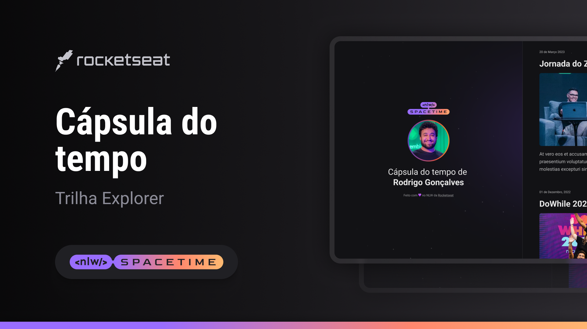

 

## 💻 Projeto
Esse é um projeto web Responsivo de uma cápsula do tempo para exibir memórias de uma linha do tempo

## 👨‍💻 Tecnologias
Esse projeto foi desenvolvido durante o NLW da  Rocketseat com as seguintes tecnologias:
- HTML
- CSS
- Git e Github
- Figma

## 🎞Layout
Você pode visualizar o layout do projeto atrvés
[desse link] (https://www.figma.com/file/9bYYC2eiIV3mikrXj4LzgX/C%C3%A1psula-do-tempo-%E2%80%A2-Trilha-Explorer-(Community)-(Copy)?type=design&node-id=306-84&t=qbXBeXbpAmnSWH3x-0).
É necessário ter um a conta no [Figma](http://WWW.figma.com)